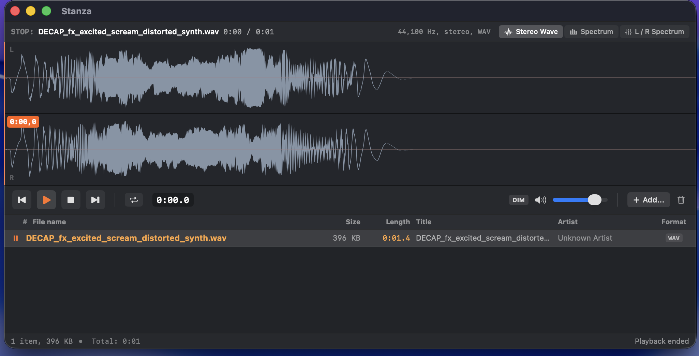

# Stanza

A minimalist, high-performance native macOS media player built in Swift and SwiftUI, featuring real-time audio visualization, split-stereo channel analysis, and seamless file queue management inspired by audio engineering players like Resonic.



---

## Key Features

- **Dual-Layer Layout**:
  - **Top Layer (Audio Visualizer & Seekbar)**:
    - **Stereo Waveform (L / R)**: Split dual-channel waveform view showing Left and Right audio channels separately with center channel division, zero-amplitude reference lines, real-time playhead tracking, and an orange timestamp badge (`m:ss,S`).
    - **Interactive Section Looping**: Click and drag across any section of the waveform to create a loop region. The player seamlessly and continuously loops the highlighted section with boundary lines and timestamp badges.
    - **Frequency Analyzer (FFT)**: Real-time logarithmic frequency spectrum (30 Hz – 20 kHz) with Accelerate `vDSP` Hann windowing, fast attack, smooth decay ballistics, and peak-hold indicators.
    - **Stereo Spectrum (L / R)**: Real-time dual-channel FFT frequency analyzer with dedicated L & R channel level/RMS meters.
    - **Full Scrubbing & Seeking**: Single-click or drag anywhere on the visualizer to seek instantly.
  - **Bottom Layer (File System Explorer & Media Browser)**:
    - **Native File System Explorer**: Replaces static playlist queues with live folder-based browsing. Listen directly to folders of audio files without manual playlist building.
    - **Split Left Navigation Pane**:
      - **Parent Folder Tree (`ParentFolderTreeView`)**: Interactive hierarchical tree view with disclosure triangles, auto-expanding down to the active directory, and ancestor breadcrumbs.
      - **Current & Sibling Folders (`SiblingFoldersView`)**: Dedicated view displaying the active folder (badged and highlighted) and all sibling folders sharing that parent, plus subdirectories.
      - **Flexible Layouts**: Switch between 3-Column horizontal mode (`Cmd+Opt+H`) and Stacked vertical mode (`Cmd+Opt+V`) with a single click or shortcut.
    - **Right Media Pane (`FolderFilesTableView`)**:
      - Lists all playable media in the active folder with metadata: Track `#`, `File name`, `Size`, `Length`, `Title`, `Artist`, and `Format`.
      - Double-click to start instant playback with dynamic waveform visualization and spectral analysis.
      - Right-click context menu to play or reveal in Finder.
    - **Folder Playback**:
      - Continuous playback toggle (`CONT` / `SINGLE`): Choose whether to advance automatically across the folder or stop after the current file.
      - Open any audio file or folder to navigate directly to its containing directory and play.

- **Audio Engine**:
  - Built on native `AVFoundation` (`AVAudioEngine`, `AVAudioPlayerNode`, `AVAudioFile`, `AVAudioPCMBuffer`) and Apple `Accelerate`.
  - Supports MP3, WAV, FLAC, AAC, M4A, AIFF, and Apple Lossless.
  - Non-blocking asynchronous waveform peak extraction with caching.
  - **Hardware-Accelerated Reverse Playback**: Play audio backwards with sub-millisecond buffer inversion via `vDSP_vrvrs`, complete with real-time waveform playhead, countdown timestamps, and synchronized FFT spectrum.

- **Transport Controls & Shortcuts**:
  - `Space`: Play / Pause
  - `Cmd + R`: Reverse playback toggle
  - `Cmd + Right`: Next file in folder
  - `Cmd + Left`: Previous file in folder
  - `Right / Left`: Quick Seek (+5s / -5s)
  - `Escape`: Clear active section loop
  - `Cmd + Up / Down`: Volume adjustment
  - `Cmd + D`: Dim volume (drops level to 25% for brief listening breaks)
  - `Cmd + M`: Mute toggle
  - `Cmd + 1`: Switch to Stereo Waveform mode
  - `Cmd + 2`: Switch to Frequency Spectrum mode
  - `Cmd + 3`: Switch to Stereo Spectrum (L/R) mode
  - `Cmd + O`: Open audio file or folder
  - `Cmd + Opt + Up`: Go to Parent Folder
  - `Cmd + Opt + H`: Explorer Columns mode (Side by Side)
  - `Cmd + Opt + V`: Explorer Stacked mode (Top / Bottom)
  - `Cmd + Opt + L`: Toggle Explorer layout

---

## How to Build and Run

### Run directly via Swift PM:
```bash
swift run
```

### Run Tests:
```bash
swift test
```

### Package into native `Stanza.app` bundle:
```bash
./Scripts/bundle_app.sh
```
The packaged application bundle will be created at `build/Stanza.app`. You can launch it with:
```bash
open build/Stanza.app
```
or drag it to your macOS `/Applications` folder.

### Create macOS DMG Installer:
```bash
./Scripts/create_dmg.sh
```
Creates `build/Stanza-1.1.0.dmg` with a drag-to-Applications installer layout.

---

## Roadmap

See [roadmap.md](roadmap.md) for planned features, upcoming releases, and tracked improvements.

